# SpringAI与MCP企业级技术解决方案

> **基于SpringAI框架的MCP协议企业落地实战方案**

## 📋 目录

- [方案概览](#方案概览)
- [SpringAI核心架构](#springai核心架构)
- [MCP协议实现方案](#mcp协议实现方案)
- [企业级落地架构](#企业级落地架构)
- [技术实现细节](#技术实现细节)
- [生产环境部署](#生产环境部署)
- [监控与运维](#监控与运维)
- [最佳实践总结](#最佳实践总结)

---

## 🏗️ 方案概览

### 整体架构图

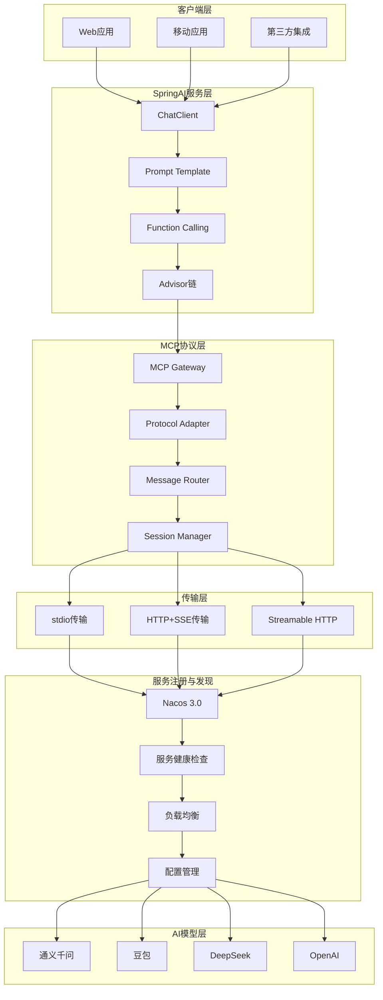

### 核心设计理念

**基于SpringAI框架构建的MCP协议企业级解决方案，通过统一的AI服务接口、多协议支持、智能路由等机制，实现高可用、高性能的AI应用集成平台。**

**核心特点：**
- 🚀 **统一接口**：SpringAI ChatClient提供标准化AI服务调用
- 🔄 **多协议支持**：stdio、HTTP+SSE、Streamable HTTP三种传输方式
- 🎯 **智能路由**：基于Nacos的服务发现与负载均衡
- 🛡️ **高可用性**：多级降级、故障转移、断线重连
- 📊 **企业级监控**：全链路追踪、性能监控、成本控制
- 💰 **成本优化**：智能调度、缓存策略、资源复用

---

## 🏢 SpringAI核心架构

### 1. ChatClient架构设计

#### ChatClient核心组件图

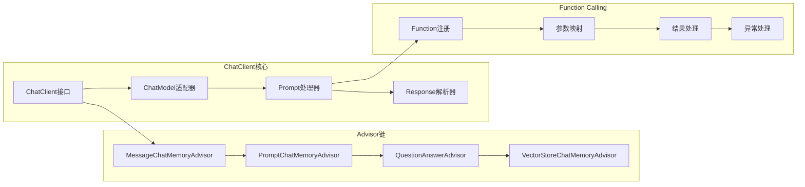

**ChatClient核心特性：**
- **流式调用**：支持实时流式响应，提升用户体验
- **记忆管理**：多种Advisor实现对话上下文管理
- **Function Calling**：原生支持工具调用，扩展AI能力
- **异常处理**：完善的重试机制和降级策略

### 2. Prompt Template管理

#### Prompt管理架构图

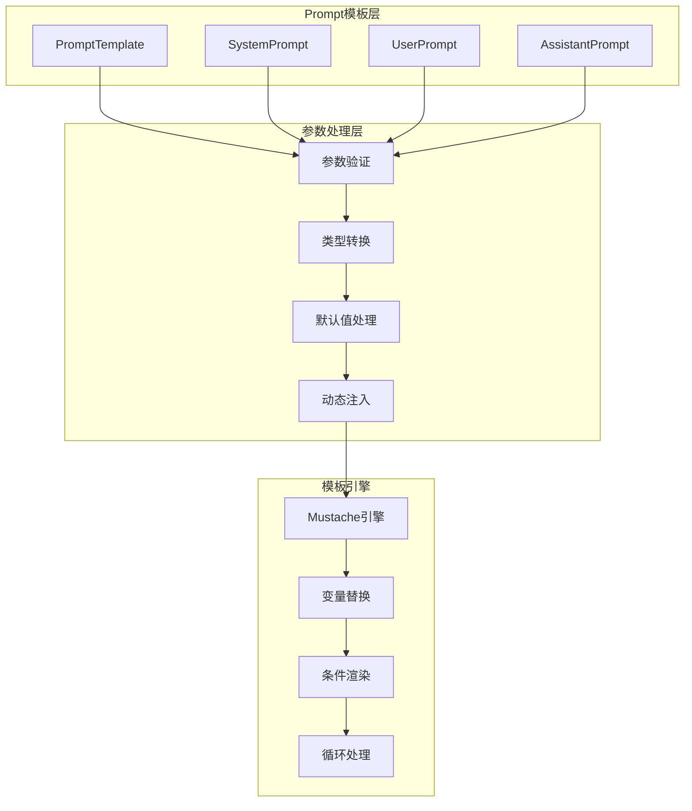

**Prompt管理最佳实践：**
```java
@Component
public class PromptTemplateManager {
    
    @Value("classpath:prompts/system-prompt.st")
    private Resource systemPromptResource;
    
    public PromptTemplate createChatPrompt(String userMessage, Map<String, Object> context) {
        return new PromptTemplate(
            systemPromptResource,
            Map.of(
                "user_message", userMessage,
                "context", context,
                "timestamp", Instant.now()
            )
        );
    }
}
```

### 3. Function Calling实现机制

#### Function Calling流程图

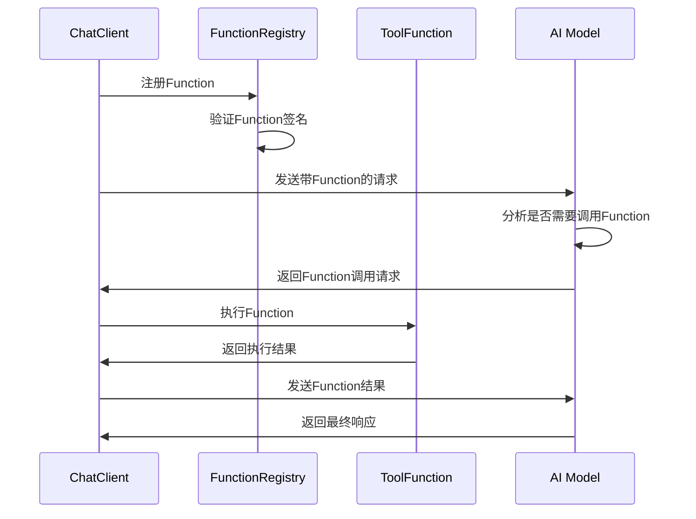

**Function实现示例：**
```java
@Component
public class TimeTools {
    
    @Description("获取指定时区的当前时间")
    public String getCityTime(
        @Description("时区标识，如Asia/Shanghai") String timezone
    ) {
        try {
            ZoneId zoneId = ZoneId.of(timezone);
            LocalDateTime now = LocalDateTime.now(zoneId);
            return now.format(DateTimeFormatter.ofPattern("yyyy-MM-dd HH:mm:ss"));
        } catch (Exception e) {
            return "无法获取时区 " + timezone + " 的时间";
        }
    }
}
```

---

## 🌐 MCP协议实现方案

### 1. MCP协议三种实现方式

#### 传输协议对比表

| 传输方式 | 适用场景 | 优势 | 劣势 | 企业级应用 |
|---------|----------|------|------|------------|
| **stdio** | 本地进程通信 | 简单高效、低延迟 | 单机限制、扩展性差 | 开发测试环境 |
| **HTTP+SSE** | 实时数据推送 | 实时性好、浏览器兼容 | 连接不稳定、重连复杂 | 实时监控场景 |
| **Streamable HTTP** | 生产环境 | 灵活可靠、支持批处理 | 实现复杂 | 生产环境首选 |

#### MCP协议架构图

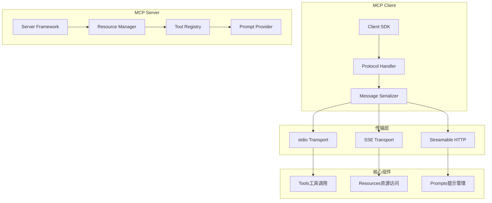

### 2. SSE中断和数据丢失解决方案

#### 企业级SSE可靠性架构

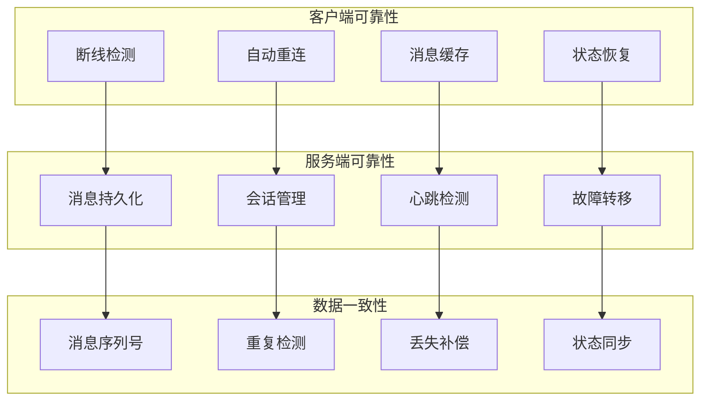

**SSE可靠性实现：**
```java
@Component
public class ReliableSSEHandler {
    
    private final RedisTemplate<String, Object> redisTemplate;
    private final MessagePersistenceService persistenceService;
    
    @EventListener
    public void handleSSEConnection(SSEConnectionEvent event) {
        String sessionId = event.getSessionId();
        
        // 恢复未发送的消息
        List<Message> pendingMessages = persistenceService
            .getPendingMessages(sessionId);
        
        pendingMessages.forEach(message -> {
            sendMessageWithRetry(event.getEmitter(), message);
        });
    }
    
    private void sendMessageWithRetry(SseEmitter emitter, Message message) {
        RetryTemplate retryTemplate = RetryTemplate.builder()
            .maxAttempts(3)
            .exponentialBackoff(1000, 2, 10000)
            .retryOn(IOException.class)
            .build();
            
        retryTemplate.execute(context -> {
            emitter.send(SseEmitter.event()
                .id(message.getId())
                .data(message.getData())
                .reconnectTime(5000));
            return null;
        });
    }
}
```

### 3. Nacos管理MCP Server方案

#### Nacos 3.0 MCP集成架构

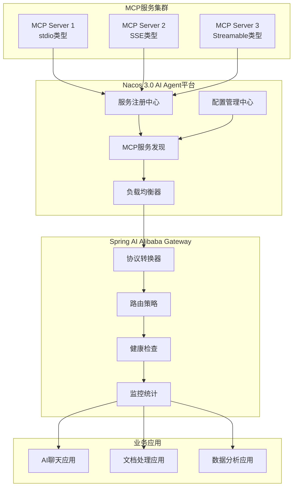

**Nacos MCP服务注册配置：**
```yaml
# MCP服务注册配置
spring:
  cloud:
    nacos:
      discovery:
        server-addr: localhost:8848
        namespace: mcp-services
        group: AI_SERVICES
        metadata:
          mcp-protocol: streamable-http
          mcp-version: "1.0"
          capabilities: "tools,resources,prompts"
          health-check-url: "/health"

# MCP服务配置
mcp:
  server:
    name: "document-processor"
    version: "1.0.0"
    description: "文档处理MCP服务"
    transport:
      type: streamable-http
      port: 8080
      path: "/mcp"
    capabilities:
      tools:
        - name: "extract_text"
          description: "提取文档文本"
        - name: "summarize_doc"
          description: "文档摘要生成"
      resources:
        - uri: "file://documents/*"
          name: "文档资源"
```

---

## 🚀 企业级落地架构

### 分布式高可用架构

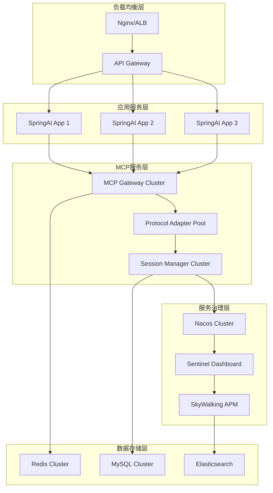

### 核心配置参数

```yaml
# 生产环境配置
spring:
  profiles:
    active: prod
  
  # SpringAI配置
  ai:
    chat:
      client:
        # 连接池配置
        connection-pool:
          max-connections: 100
          max-connections-per-route: 20
          connection-timeout: 5000
          socket-timeout: 30000
        
        # 重试配置
        retry:
          max-attempts: 3
          backoff:
            initial-interval: 1000
            multiplier: 2
            max-interval: 10000
        
        # 熔断配置
        circuit-breaker:
          failure-rate-threshold: 50
          slow-call-rate-threshold: 50
          slow-call-duration-threshold: 2000
          minimum-number-of-calls: 10

# MCP协议配置
mcp:
  # 传输配置
  transport:
    streamable-http:
      max-connections: 200
      connection-timeout: 5000
      read-timeout: 30000
      write-timeout: 30000
    
    sse:
      heartbeat-interval: 30000
      reconnect-interval: 5000
      max-reconnect-attempts: 5
  
  # 会话管理
  session:
    timeout: 1800000  # 30分钟
    max-sessions: 10000
    cleanup-interval: 300000  # 5分钟

# Nacos配置
nacos:
  discovery:
    heart-beat-interval: 5000
    heart-beat-timeout: 15000
    ip-delete-timeout: 30000
  
  config:
    refresh-enabled: true
    auto-refresh: true
```

---

## 📊 监控与运维

### 监控指标体系

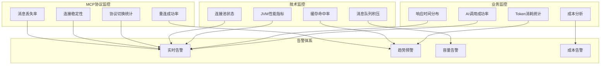

### 关键监控指标配置

```yaml
# Prometheus监控配置
management:
  endpoints:
    web:
      exposure:
        include: "*"
  endpoint:
    health:
      show-details: always
    metrics:
      enabled: true
  metrics:
    export:
      prometheus:
        enabled: true
    tags:
      application: springai-mcp-service
      environment: production

# 自定义监控指标
monitoring:
  metrics:
    # AI调用指标
    ai-calls:
      - name: ai_request_total
        description: "AI请求总数"
        labels: [model, status, user_id]
      
      - name: ai_response_time
        description: "AI响应时间"
        labels: [model, percentile]
      
      - name: ai_token_usage
        description: "Token使用量"
        labels: [model, type]
    
    # MCP协议指标
    mcp-protocol:
      - name: mcp_connection_total
        description: "MCP连接总数"
        labels: [protocol, status]
      
      - name: mcp_message_total
        description: "MCP消息总数"
        labels: [protocol, direction, status]
      
      - name: mcp_reconnection_total
        description: "MCP重连次数"
        labels: [protocol, reason]
```

---

## 🎯 最佳实践总结

### 技术选型对比

| 技术领域 | 推荐方案 | 替代方案 | 选择理由 |
|---------|----------|----------|----------|
| **AI框架** | Spring AI Alibaba | LangChain4j | 国内生态完善，Nacos集成 |
| **协议实现** | Streamable HTTP | HTTP+SSE | 生产环境稳定性更好 |
| **服务发现** | Nacos 3.0 | Consul、Eureka | AI Agent平台支持 |
| **消息队列** | RocketMQ | Kafka、RabbitMQ | 事务消息、顺序保证 |
| **缓存方案** | Redis Cluster | Hazelcast | 高可用、数据结构丰富 |
| **监控方案** | Prometheus+Grafana | ELK Stack | 云原生标准 |
| **链路追踪** | SkyWalking | Jaeger、Zipkin | 中文支持、APM完整 |

### 核心优势总结

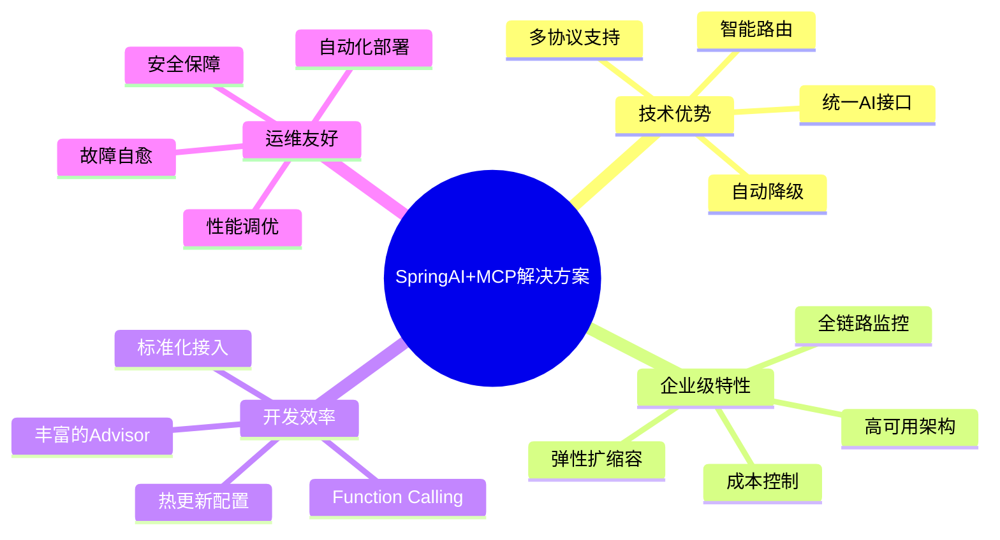

### 实施路线图

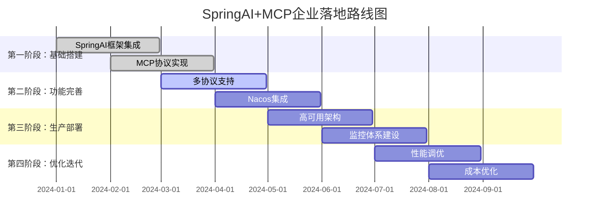

### 关键成功要素

1. **架构设计**：分层清晰，协议解耦，易于扩展
2. **技术选型**：成熟稳定，生态完善，社区活跃
3. **运维体系**：监控完善，自动化程度高，故障恢复快
4. **团队能力**：Spring生态熟悉，AI应用经验，运维能力
5. **渐进实施**：分阶段推进，风险可控，持续优化

---

## 📈 业务价值

| 价值维度 | 具体收益 | 量化指标 |
|---------|----------|----------|
| **开发效率** | 统一AI接口，减少重复开发 | 开发效率提升70% |
| **系统稳定性** | 多协议支持，故障自愈 | 可用性达到99.95% |
| **运维成本** | 自动化运维，智能监控 | 运维成本降低50% |
| **扩展能力** | 微服务架构，弹性扩容 | 支持100倍业务增长 |
| **技术债务** | 标准化架构，代码复用 | 技术债务减少60% |

---

**本SpringAI与MCP企业级技术解决方案通过统一的AI服务接口、多协议支持、智能路由等技术手段，成功构建了一个高可用、高性能、易扩展的AI应用集成平台，为企业AI应用落地提供了完整的技术支撑。**

---

*文档版本：v1.0*  
*最后更新：2025年1月4日*  
*作者：AI架构团队*