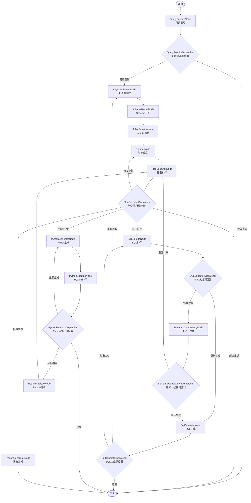

# NL2SQL Graph工作流执行原理与流转分析

## 🎯 概述

基于对`Nl2sqlConfiguration.java`配置文件和各个节点实现的深度分析，本文详细解析Spring AI Alibaba NL2SQL项目中Graph工作流的执行原理、节点流转顺序和调度机制。

## 🏗️ Graph工作流架构

### 核心组件构成

```java
// Nl2sqlConfiguration.java - Graph构建核心
@Bean
public StateGraph nl2sqlGraph(ChatClient.Builder chatClientBuilder) throws GraphStateException {
    
    // 1. 键策略工厂 - 定义状态管理策略
    KeyStrategyFactory keyStrategyFactory = () -> {
        HashMap<String, KeyStrategy> keyStrategyHashMap = new HashMap<>();
        // 所有状态键都使用替换策略
        keyStrategyHashMap.put(INPUT_KEY, new ReplaceStrategy());
        keyStrategyHashMap.put(AGENT_ID, new ReplaceStrategy());
        // ... 更多状态键配置
        return keyStrategyHashMap;
    };
    
    // 2. 创建StateGraph并注册13个核心节点
    StateGraph stateGraph = new StateGraph(NL2SQL_GRAPH_NAME, keyStrategyFactory)
        .addNode(QUERY_REWRITE_NODE, node_async(new QueryRewriteNode(nl2SqlService)))
        .addNode(KEYWORD_EXTRACT_NODE, node_async(new KeywordExtractNode(nl2SqlService)))
        // ... 其他节点注册
        ;
    
    // 3. 定义节点间的连接关系和路由规则
    stateGraph.addEdge(START, QUERY_REWRITE_NODE)
        .addConditionalEdges(QUERY_REWRITE_NODE, edge_async(new QueryRewriteDispatcher()),
            Map.of(KEYWORD_EXTRACT_NODE, KEYWORD_EXTRACT_NODE, END, END))
        // ... 更多边的定义
        ;
}
```

## 📊 完整节点流转图

### 主要执行路径



## 🔄 详细流转分析

### 第一阶段：自然语言理解

#### 1. QueryRewriteNode (问题重写节点)
**位置**: `com.alibaba.cloud.ai.node.QueryRewriteNode`

```java
@Override
public Map<String, Object> execute(OverAllState state, RunnableConfig config) {
    // 获取用户原始输入
    String originalQuery = (String) state.value(INPUT_KEY).orElse("");
    
    // 使用LLM重写查询，使其更清晰、更具体
    String rewrittenQuery = nl2SqlService.rewrite(originalQuery);
    
    // 返回重写后的查询
    return Map.of(
        QUERY_REWRITE_NODE_OUTPUT, rewrittenQuery,
        "original_query", originalQuery
    );
}
```

**功能**:
- 接收用户原始自然语言输入
- 使用大语言模型优化和标准化查询表达
- 消除歧义，增强查询的明确性

**输出状态**:
- `QUERY_REWRITE_NODE_OUTPUT`: 重写后的查询
- `original_query`: 原始查询（备份）

#### 2. QueryRewriteDispatcher (问题重写调度器)
**位置**: `com.alibaba.cloud.ai.dispatcher.QueryRewriteDispatcher`

```java
@Override
public String execute(OverAllState state, RunnableConfig config) {
    String rewrittenQuery = (String) state.value(QUERY_REWRITE_NODE_OUTPUT).orElse("");
    
    // 判断重写后的查询是否有效
    if (isValidQuery(rewrittenQuery)) {
        return KEYWORD_EXTRACT_NODE;  // 继续处理
    } else {
        return END;  // 结束流程
    }
}
```

**路由逻辑**:
- 有效查询 → `KEYWORD_EXTRACT_NODE`
- 无效查询 → `END`

#### 3. KeywordExtractNode (关键词提取节点)
**位置**: `com.alibaba.cloud.ai.node.KeywordExtractNode`

```java
@Override
public Map<String, Object> execute(OverAllState state, RunnableConfig config) {
    String query = (String) state.value(QUERY_REWRITE_NODE_OUTPUT).orElse("");
    List<String> evidences = (List<String>) state.value(EVIDENCES).orElse(new ArrayList<>());
    
    // 提取关键词和实体
    List<String> keywords = nl2SqlService.extractKeywords(query, evidences);
    
    return Map.of(
        KEYWORD_EXTRACT_NODE_OUTPUT, keywords,
        EVIDENCES, evidences
    );
}
```

**功能**:
- 从重写后的查询中提取关键词
- 识别重要的业务实体和概念
- 为后续Schema检索提供搜索条件

### 第二阶段：Schema检索与理解

#### 4. SchemaRecallNode (Schema召回节点)
**位置**: `com.alibaba.cloud.ai.node.SchemaRecallNode`

```java
@Override
public Map<String, Object> execute(OverAllState state, RunnableConfig config) {
    String query = (String) state.value(QUERY_REWRITE_NODE_OUTPUT).orElse("");
    List<String> keywords = (List<String>) state.value(KEYWORD_EXTRACT_NODE_OUTPUT).orElse(new ArrayList<>());
    
    // 基于向量检索召回相关的数据库Schema
    List<Document> tableDocuments = schemaService.getDocuments(query, "table");
    List<Document> columnDocuments = schemaService.getDocumentsByKeywords(keywords, "column");
    
    return Map.of(
        TABLE_DOCUMENTS_FOR_SCHEMA_OUTPUT, tableDocuments,
        COLUMN_DOCUMENTS_BY_KEYWORDS_OUTPUT, columnDocuments
    );
}
```

**功能**:
- 使用向量检索技术召回相关的数据库表和字段
- 基于语义相似度匹配最相关的Schema信息
- 为SQL生成提供必要的数据库结构信息

#### 5. TableRelationNode (表关系构建节点)
**位置**: `com.alibaba.cloud.ai.node.TableRelationNode`

```java
@Override
public Map<String, Object> execute(OverAllState state, RunnableConfig config) {
    // 获取召回的Schema信息
    List<Document> tableDocuments = (List<Document>) state.value(TABLE_DOCUMENTS_FOR_SCHEMA_OUTPUT).orElse(new ArrayList<>());
    List<Document> columnDocuments = (List<Document>) state.value(COLUMN_DOCUMENTS_BY_KEYWORDS_OUTPUT).orElse(new ArrayList<>());
    
    // 获取业务知识和语义模型
    String businessKnowledge = businessKnowledgeRecallService.recall(query);
    String semanticModel = semanticModelRecallService.recall(query);
    
    // 构建完整的Schema关系
    SchemaDTO schemaDTO = buildCompleteSchema(tableDocuments, columnDocuments, businessKnowledge, semanticModel);
    
    return Map.of(
        TABLE_RELATION_OUTPUT, schemaDTO,
        BUSINESS_KNOWLEDGE, businessKnowledge,
        SEMANTIC_MODEL, semanticModel
    );
}
```

**功能**:
- 分析表之间的关联关系
- 融合业务知识和语义模型
- 构建完整的Schema上下文

### 第三阶段：智能规划

#### 6. PlannerNode (智能规划节点)
**位置**: `com.alibaba.cloud.ai.node.PlannerNode`

```java
@Override
public Map<String, Object> execute(OverAllState state, RunnableConfig config) {
    String query = (String) state.value(QUERY_REWRITE_NODE_OUTPUT).orElse("");
    SchemaDTO schema = (SchemaDTO) state.value(TABLE_RELATION_OUTPUT);
    
    // 使用大语言模型制定执行计划
    String plan = chatClient.prompt()
        .system("你是一个智能数据分析规划师，根据用户查询和Schema信息制定最优的执行计划")
        .user(buildPlanningPrompt(query, schema))
        .call()
        .content();
    
    // 解析计划步骤
    List<PlanStep> planSteps = parsePlanSteps(plan);
    
    return Map.of(
        PLANNER_NODE_OUTPUT, plan,
        "plan_steps", planSteps,
        PLAN_CURRENT_STEP, 0
    );
}
```

**功能**:
- 基于查询意图和Schema信息制定执行计划
- 决定是执行SQL查询、Python分析还是生成报告
- 为复杂查询规划多步骤执行策略

#### 7. PlanExecutorNode (计划执行节点)
**位置**: `com.alibaba.cloud.ai.node.PlanExecutorNode`

```java
@Override
public Map<String, Object> execute(OverAllState state, RunnableConfig config) {
    List<PlanStep> planSteps = (List<PlanStep>) state.value("plan_steps").orElse(new ArrayList<>());
    Integer currentStep = (Integer) state.value(PLAN_CURRENT_STEP).orElse(0);
    
    if (currentStep >= planSteps.size()) {
        return Map.of(PLAN_NEXT_NODE, END);
    }
    
    PlanStep step = planSteps.get(currentStep);
    
    // 验证当前步骤的可执行性
    ValidationResult validation = validateStep(step, state);
    
    if (validation.isValid()) {
        return Map.of(
            PLAN_NEXT_NODE, step.getNodeName(),
            PLAN_CURRENT_STEP, currentStep + 1,
            PLAN_VALIDATION_STATUS, "valid"
        );
    } else {
        return Map.of(
            PLAN_VALIDATION_STATUS, "invalid",
            PLAN_VALIDATION_ERROR, validation.getError(),
            PLAN_REPAIR_COUNT, getRepairCount(state) + 1
        );
    }
}
```

**功能**:
- 验证计划步骤的可执行性
- 控制计划的执行顺序
- 处理执行失败和重试逻辑

#### 8. PlanExecutorDispatcher (计划执行调度器)
**位置**: `com.alibaba.cloud.ai.dispatcher.PlanExecutorDispatcher`

```java
@Override
public String execute(OverAllState state, RunnableConfig config) {
    String validationStatus = (String) state.value(PLAN_VALIDATION_STATUS).orElse("");
    String nextNode = (String) state.value(PLAN_NEXT_NODE).orElse("");
    Integer repairCount = (Integer) state.value(PLAN_REPAIR_COUNT).orElse(0);
    
    if ("invalid".equals(validationStatus)) {
        if (repairCount >= MAX_REPAIR_COUNT) {
            return END;  // 超过最大重试次数
        } else {
            return PLANNER_NODE;  // 重新规划
        }
    }
    
    // 根据计划决定下一个节点
    return nextNode;
}
```

**路由逻辑**:
- 验证失败且未超过重试次数 → `PLANNER_NODE`
- 验证失败且超过重试次数 → `END`
- 验证成功 → 计划指定的下一个节点

### 第四阶段：SQL处理路径

#### 9. SqlGenerateNode (SQL生成节点)
**位置**: `com.alibaba.cloud.ai.node.SqlGenerateNode`

```java
@Override
public Map<String, Object> execute(OverAllState state, RunnableConfig config) {
    String query = (String) state.value(QUERY_REWRITE_NODE_OUTPUT).orElse("");
    SchemaDTO schema = (SchemaDTO) state.value(TABLE_RELATION_OUTPUT);
    String businessKnowledge = (String) state.value(BUSINESS_KNOWLEDGE).orElse("");
    
    // 构建SQL生成提示
    String prompt = buildSqlGenerationPrompt(query, schema, businessKnowledge);
    
    // 使用大语言模型生成SQL
    String sql = chatClient.prompt()
        .system("你是一个专业的SQL专家，根据用户查询和数据库Schema生成准确的SQL语句")
        .user(prompt)
        .call()
        .content();
    
    // 增加生成计数
    Integer generateCount = (Integer) state.value(SQL_GENERATE_COUNT).orElse(0);
    
    return Map.of(
        SQL_GENERATE_OUTPUT, sql,
        SQL_GENERATE_COUNT, generateCount + 1
    );
}
```

**功能**:
- 基于Schema和业务知识生成SQL语句
- 使用大语言模型确保SQL的准确性
- 跟踪生成次数以控制重试

#### 10. SqlGenerateDispatcher (SQL生成调度器)
**位置**: `com.alibaba.cloud.ai.dispatcher.SqlGenerateDispatcher`

```java
@Override
public String execute(OverAllState state, RunnableConfig config) {
    String sql = (String) state.value(SQL_GENERATE_OUTPUT).orElse("");
    Integer generateCount = (Integer) state.value(SQL_GENERATE_COUNT).orElse(0);
    
    // 验证SQL的有效性
    if (isValidSql(sql)) {
        return SQL_EXECUTE_NODE;  // 执行SQL
    } else if (generateCount < MAX_GENERATE_COUNT) {
        return KEYWORD_EXTRACT_NODE;  // 重新提取关键词
    } else {
        return END;  // 超过重试次数，结束
    }
}
```

**路由逻辑**:
- SQL有效 → `SQL_EXECUTE_NODE`
- SQL无效且未超过重试次数 → `KEYWORD_EXTRACT_NODE`
- SQL无效且超过重试次数 → `END`

#### 11. SqlExecuteNode (SQL执行节点)
**位置**: `com.alibaba.cloud.ai.node.SqlExecuteNode`

```java
@Override
public Map<String, Object> execute(OverAllState state, RunnableConfig config) {
    String sql = (String) state.value(SQL_GENERATE_OUTPUT).orElse("");
    String agentId = (String) state.value(AGENT_ID).orElse("");
    
    try {
        // 获取智能体对应的数据源配置
        DbConfig dbConfig = datasourceService.getDbConfigForAgent(Integer.valueOf(agentId));
        
        // 执行SQL查询
        ResultSetBO result = dbAccessor.query(new DbQueryParameter(sql, dbConfig));
        
        return Map.of(
            SQL_EXECUTE_NODE_OUTPUT, result,
            "execution_success", true
        );
        
    } catch (Exception e) {
        return Map.of(
            SQL_EXECUTE_NODE_EXCEPTION_OUTPUT, e.getMessage(),
            "execution_success", false
        );
    }
}
```

**功能**:
- 根据智能体ID获取对应的数据源配置
- 执行生成的SQL语句
- 处理执行异常和错误

#### 12. SQLExecutorDispatcher (SQL执行调度器)
**位置**: `com.alibaba.cloud.ai.dispatcher.SQLExecutorDispatcher`

```java
@Override
public String execute(OverAllState state, RunnableConfig config) {
    Boolean executionSuccess = (Boolean) state.value("execution_success").orElse(false);
    String exception = (String) state.value(SQL_EXECUTE_NODE_EXCEPTION_OUTPUT).orElse("");
    
    if (!executionSuccess) {
        // 执行失败，重新生成SQL
        return SQL_GENERATE_NODE;
    }
    
    // 执行成功，进行语义一致性检查
    return SEMANTIC_CONSISTENCY_NODE;
}
```

**路由逻辑**:
- 执行失败 → `SQL_GENERATE_NODE`
- 执行成功 → `SEMANTIC_CONSISTENCY_NODE`

#### 13. SemanticConsistencyNode (语义一致性检查节点)
**位置**: `com.alibaba.cloud.ai.node.SemanticConsistencyNode`

```java
@Override
public Map<String, Object> execute(OverAllState state, RunnableConfig config) {
    String originalQuery = (String) state.value("original_query").orElse("");
    String sql = (String) state.value(SQL_GENERATE_OUTPUT).orElse("");
    ResultSetBO result = (ResultSetBO) state.value(SQL_EXECUTE_NODE_OUTPUT);
    
    // 使用大语言模型检查语义一致性
    String consistencyCheck = nl2SqlService.checkSemanticConsistency(originalQuery, sql, result);
    
    // 解析检查结果
    boolean isConsistent = parseConsistencyResult(consistencyCheck);
    
    return Map.of(
        SEMANTIC_CONSISTENCY_NODE_OUTPUT, consistencyCheck,
        "is_consistent", isConsistent
    );
}
```

**功能**:
- 检查SQL结果与用户原始意图的一致性
- 使用大语言模型进行语义验证
- 确保返回结果的准确性

### 第五阶段：Python分析路径

#### 14. PythonGenerateNode (Python代码生成节点)
**位置**: `com.alibaba.cloud.ai.node.PythonGenerateNode`

```java
@Override
public Map<String, Object> execute(OverAllState state, RunnableConfig config) {
    String query = (String) state.value(QUERY_REWRITE_NODE_OUTPUT).orElse("");
    ResultSetBO sqlResult = (ResultSetBO) state.value(SQL_EXECUTE_NODE_OUTPUT);
    
    // 生成Python数据分析代码
    String pythonCode = chatClient.prompt()
        .system("你是一个专业的数据分析师，根据用户查询和SQL结果生成Python分析代码")
        .user(buildPythonGenerationPrompt(query, sqlResult))
        .call()
        .content();
    
    return Map.of(
        PYTHON_GENERATE_NODE_OUTPUT, pythonCode,
        PYTHON_TRIES_COUNT, 0
    );
}
```

**功能**:
- 基于SQL查询结果生成Python分析代码
- 支持数据可视化和统计分析
- 为复杂数据分析提供代码支持

#### 15. PythonExecuteNode (Python代码执行节点)
**位置**: `com.alibaba.cloud.ai.node.PythonExecuteNode`

```java
@Override
public Map<String, Object> execute(OverAllState state, RunnableConfig config) {
    String pythonCode = (String) state.value(PYTHON_GENERATE_NODE_OUTPUT).orElse("");
    ResultSetBO sqlResult = (ResultSetBO) state.value(SQL_EXECUTE_NODE_OUTPUT);
    
    try {
        // 在沙箱环境中执行Python代码
        ExecutionResult result = codePoolExecutor.execute(pythonCode, sqlResult);
        
        return Map.of(
            PYTHON_EXECUTE_NODE_OUTPUT, result,
            PYTHON_IS_SUCCESS, result.isSuccess()
        );
        
    } catch (Exception e) {
        Integer tryCount = (Integer) state.value(PYTHON_TRIES_COUNT).orElse(0);
        return Map.of(
            PYTHON_IS_SUCCESS, false,
            PYTHON_TRIES_COUNT, tryCount + 1,
            "python_error", e.getMessage()
        );
    }
}
```

**功能**:
- 在安全的沙箱环境中执行Python代码
- 处理代码执行异常
- 跟踪执行尝试次数

#### 16. PythonAnalyzeNode (Python结果分析节点)
**位置**: `com.alibaba.cloud.ai.node.PythonAnalyzeNode`

```java
@Override
public Map<String, Object> execute(OverAllState state, RunnableConfig config) {
    ExecutionResult pythonResult = (ExecutionResult) state.value(PYTHON_EXECUTE_NODE_OUTPUT);
    String originalQuery = (String) state.value("original_query").orElse("");
    
    // 分析Python执行结果
    String analysis = chatClient.prompt()
        .system("你是一个数据分析专家，分析Python代码的执行结果并提供洞察")
        .user(buildAnalysisPrompt(originalQuery, pythonResult))
        .call()
        .content();
    
    return Map.of(
        PYTHON_ANALYSIS_NODE_OUTPUT, analysis
    );
}
```

**功能**:
- 分析Python代码的执行结果
- 提供数据洞察和解释
- 生成用户友好的分析报告

### 第六阶段：报告生成

#### 17. ReportGeneratorNode (报告生成节点)
**位置**: `com.alibaba.cloud.ai.node.ReportGeneratorNode`

```java
@Override
public Map<String, Object> execute(OverAllState state, RunnableConfig config) {
    String originalQuery = (String) state.value("original_query").orElse("");
    ResultSetBO sqlResult = (ResultSetBO) state.value(SQL_EXECUTE_NODE_OUTPUT);
    String pythonAnalysis = (String) state.value(PYTHON_ANALYSIS_NODE_OUTPUT).orElse("");
    
    // 获取用户自定义的报告模板
    String reportTemplate = promptConfigService.getReportTemplate(agentId);
    
    // 生成综合报告
    String report = chatClient.prompt()
        .system("你是一个专业的报告生成专家，根据数据分析结果生成结构化报告")
        .user(buildReportPrompt(originalQuery, sqlResult, pythonAnalysis, reportTemplate))
        .call()
        .content();
    
    return Map.of(
        RESULT, report
    );
}
```

**功能**:
- 整合SQL查询结果和Python分析结果
- 使用自定义模板生成报告
- 提供最终的综合分析结果

## 🔄 调度器路由机制

### 核心调度器分析

#### 1. 条件分支路由
```java
// 在Nl2sqlConfiguration中定义的条件边
.addConditionalEdges(QUERY_REWRITE_NODE, edge_async(new QueryRewriteDispatcher()),
    Map.of(KEYWORD_EXTRACT_NODE, KEYWORD_EXTRACT_NODE, END, END))
```

#### 2. 调度器决策逻辑
每个调度器都实现了`EdgeAction`接口：

```java
public interface EdgeAction {
    String execute(OverAllState state, RunnableConfig config);
}
```

调度器根据当前状态数据做出路由决策，返回下一个节点的名称。

### 路由决策表

| 调度器 | 输入条件 | 路由结果 |
|--------|----------|----------|
| QueryRewriteDispatcher | 查询有效性 | KEYWORD_EXTRACT_NODE / END |
| SqlGenerateDispatcher | SQL有效性 + 重试次数 | SQL_EXECUTE_NODE / KEYWORD_EXTRACT_NODE / END |
| SQLExecutorDispatcher | 执行成功性 | SEMANTIC_CONSISTENCY_NODE / SQL_GENERATE_NODE |
| SemanticConsistenceDispatcher | 语义一致性 | SQL_GENERATE_NODE / PLAN_EXECUTOR_NODE |
| PlanExecutorDispatcher | 验证状态 + 重试次数 | 目标节点 / PLANNER_NODE / END |
| PythonExecutorDispatcher | 执行成功性 + 重试次数 | PYTHON_ANALYZE_NODE / PYTHON_GENERATE_NODE / END |

## 🎯 状态管理机制

### 状态键策略

```java
// 所有状态键都使用ReplaceStrategy
keyStrategyHashMap.put(INPUT_KEY, new ReplaceStrategy());
keyStrategyHashMap.put(AGENT_ID, new ReplaceStrategy());
keyStrategyHashMap.put(QUERY_REWRITE_NODE_OUTPUT, new ReplaceStrategy());
// ... 更多状态键
```

**ReplaceStrategy**: 新值直接替换旧值，适合大多数场景。

### 关键状态流转

```
用户输入 (INPUT_KEY)
    ↓
重写查询 (QUERY_REWRITE_NODE_OUTPUT)
    ↓
关键词 (KEYWORD_EXTRACT_NODE_OUTPUT)
    ↓
Schema信息 (TABLE_DOCUMENTS_FOR_SCHEMA_OUTPUT)
    ↓
表关系 (TABLE_RELATION_OUTPUT)
    ↓
执行计划 (PLANNER_NODE_OUTPUT)
    ↓
SQL语句 (SQL_GENERATE_OUTPUT)
    ↓
执行结果 (SQL_EXECUTE_NODE_OUTPUT)
    ↓
最终结果 (RESULT)
```

## 🚀 异步执行机制

### 异步节点包装

```java
// 所有节点都使用node_async包装
.addNode(QUERY_REWRITE_NODE, node_async(new QueryRewriteNode(nl2SqlService)))
```

**node_async**: 将同步节点包装为异步执行，支持：
- 非阻塞执行
- 并发处理
- 流式输出

### 异步边包装

```java
// 所有调度器都使用edge_async包装
.addConditionalEdges(QUERY_REWRITE_NODE, edge_async(new QueryRewriteDispatcher()), ...)
```

**edge_async**: 将同步调度器包装为异步执行。

## 🔍 流式输出机制

### StreamingOutput接口

某些节点可能实现`StreamingOutput`接口，支持流式数据输出：

```java
if (output instanceof StreamingOutput) {
    StreamingOutput streamingOutput = (StreamingOutput) output;
    String chunk = streamingOutput.chunk();
    // 处理数据块
}
```

### 实时响应

通过`streamSearch`接口，客户端可以实时接收到：
- 节点执行进度
- 中间处理结果
- 最终输出结果

## 📊 执行流程总结

### 典型执行路径

1. **START** → **QueryRewriteNode** → **QueryRewriteDispatcher**
2. **KeywordExtractNode** → **SchemaRecallNode** → **TableRelationNode**
3. **PlannerNode** → **PlanExecutorNode** → **PlanExecutorDispatcher**
4. **SqlGenerateNode** → **SqlGenerateDispatcher** → **SqlExecuteNode**
5. **SQLExecutorDispatcher** → **SemanticConsistencyNode** → **SemanticConsistenceDispatcher**
6. **PlanExecutorNode** → **ReportGeneratorNode** → **END**

### 可能的分支路径

- **Python分析路径**: PlanExecutorNode → PythonGenerateNode → PythonExecuteNode → PythonAnalyzeNode
- **重试路径**: 各种Dispatcher可能触发重试，回到之前的节点
- **错误终止**: 超过重试次数或遇到不可恢复错误时直接到END

### 容错机制

1. **重试机制**: 各个调度器都有重试逻辑
2. **错误隔离**: 单个节点失败不影响整体流程
3. **优雅降级**: 复杂分析失败时可以返回基础SQL结果
4. **超时控制**: 防止无限循环和长时间阻塞

## 🎯 核心设计优势

### 1. 声明式工作流
- 通过配置定义复杂的业务流程
- 节点和边的清晰分离
- 易于理解和维护

### 2. 智能路由
- 基于状态数据的动态路由
- 支持条件分支和循环
- 自适应的执行策略

### 3. 异步优先
- 全链路异步执行
- 支持高并发处理
- 实时流式响应

### 4. 状态驱动
- 完整的状态管理机制
- 状态在节点间安全传递
- 支持状态回溯和调试

### 5. 可扩展性
- 模块化的节点设计
- 插件化的调度器
- 易于添加新功能

这种Graph工作流设计代表了现代AI应用架构的最佳实践，通过声明式编程、异步执行和智能路由，实现了复杂NL2SQL业务流程的高效编排和执行。