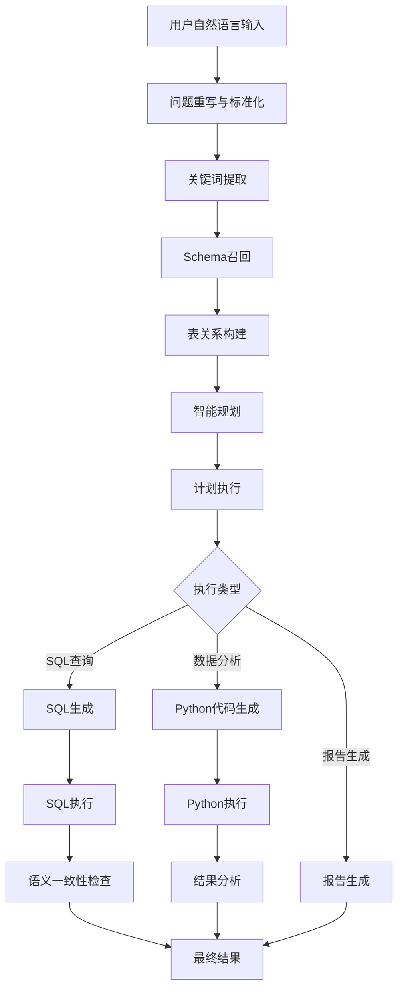

# 第一章：Spring AI Alibaba NL2SQL 项目整体架构设计

## 🎯 学习目标

- 深入理解NL2SQL项目的整体架构设计思路
- 掌握各模块间的依赖关系和接口设计
- 分析分层架构的设计原则和实现方式
- 理解Graph工作流在业务架构中的核心作用

## 📚 项目架构全景

### 1.1 模块架构概览

```
spring-ai-alibaba-nl2sql/
├── spring-ai-alibaba-nl2sql-chat/        # 🧠 核心NL2SQL引擎
│   ├── src/main/java/com/alibaba/cloud/ai/
│   │   ├── config/                       # Graph工作流配置
│   │   ├── service/                      # 核心业务服务
│   │   ├── node/                         # Graph节点实现
│   │   ├── dispatcher/                   # 路由调度器
│   │   └── connector/                    # 数据库连接器
│   └── src/main/resources/
├── spring-ai-alibaba-nl2sql-management/  # 🎛️ 管理端服务
│   ├── src/main/java/com/alibaba/cloud/ai/
│   │   ├── controller/                   # REST API控制器
│   │   ├── service/                      # 管理业务服务
│   │   └── config/                       # 配置管理
│   └── src/main/resources/
├── spring-ai-alibaba-nl2sql-common/      # 🔧 公共组件
│   └── src/main/java/com/alibaba/cloud/ai/
│       ├── dto/                          # 数据传输对象
│       ├── util/                         # 工具类
│       └── constant/                     # 常量定义
└── spring-ai-alibaba-nl2sql-web-ui/      # 🖥️ 前端界面
    ├── src/
    │   ├── views/                        # Vue页面组件
    │   ├── components/                   # 公共组件
    │   └── utils/                        # 前端工具
    └── package.json
```

### 1.2 核心架构设计原则

#### 分层架构设计

```
┌─────────────────────────────────────────┐
│              表现层 (Presentation)       │
│  Web UI + REST API + WebSocket         │
├─────────────────────────────────────────┤
│              应用层 (Application)        │
│  业务编排 + Graph工作流 + 服务协调      │
├─────────────────────────────────────────┤
│              领域层 (Domain)             │
│  NL2SQL核心逻辑 + 业务规则 + 实体模型   │
├─────────────────────────────────────────┤
│              基础设施层 (Infrastructure)  │
│  数据库访问 + 向量存储 + 外部服务集成    │
└─────────────────────────────────────────┘
```

#### 模块职责划分

| 模块 | 核心职责 | 关键组件 |
|------|----------|----------|
| **chat** | NL2SQL核心引擎 | Graph工作流、节点实现、调度器 |
| **management** | 系统管理服务 | API控制器、配置管理、监控 |
| **common** | 公共基础组件 | DTO、工具类、常量定义 |
| **web-ui** | 用户交互界面 | Vue组件、页面路由、状态管理 |

### 1.3 核心技术架构

#### Graph工作流架构

```java
/**
 * NL2SQL Graph工作流核心架构
 */
@Configuration
public class Nl2sqlConfiguration {
    
    /**
     * 构建NL2SQL Graph工作流
     * 这是整个系统的核心编排引擎
     */
    @Bean
    public StateGraph nl2sqlGraph(ChatClient.Builder chatClientBuilder) {
        return new StateGraph(NL2SQL_GRAPH_NAME, keyStrategyFactory)
            // 自然语言理解阶段
            .addNode(QUERY_REWRITE_NODE, node_async(new QueryRewriteNode(nl2SqlService)))
            .addNode(KEYWORD_EXTRACT_NODE, node_async(new KeywordExtractNode(nl2SqlService)))
            
            // Schema检索阶段
            .addNode(SCHEMA_RECALL_NODE, node_async(new SchemaRecallNode(schemaService)))
            .addNode(TABLE_RELATION_NODE, node_async(new TableRelationNode(
                schemaService, nl2SqlService, businessKnowledgeRecallService, semanticModelRecallService)))
            
            // SQL生成与验证阶段
            .addNode(SQL_GENERATE_NODE, node_async(new SqlGenerateNode(chatClientBuilder, nl2SqlService)))
            .addNode(SEMANTIC_CONSISTENCY_NODE, node_async(new SemanticConsistencyNode(nl2SqlService)))
            
            // 执行与分析阶段
            .addNode(SQL_EXECUTE_NODE, node_async(new SqlExecuteNode(dbAccessor, dbConfig)))
            .addNode(PYTHON_GENERATE_NODE, node_async(new PythonGenerateNode(codeExecutorProperties, chatClientBuilder)))
            .addNode(PYTHON_EXECUTE_NODE, node_async(new PythonExecuteNode(codePoolExecutor)))
            
            // 智能规划阶段
            .addNode(PLANNER_NODE, node_async(new PlannerNode(chatClientBuilder)))
            .addNode(PLAN_EXECUTOR_NODE, node_async(new PlanExecutorNode()))
            
            // 报告生成阶段
            .addNode(REPORT_GENERATOR_NODE, node_async(new ReportGeneratorNode(chatClientBuilder)))
            
            // 定义工作流路径
            .addEdge(START, QUERY_REWRITE_NODE)
            .addConditionalEdges(QUERY_REWRITE_NODE, edge_async(new QueryRewriteDispatcher()),
                Map.of(KEYWORD_EXTRACT_NODE, KEYWORD_EXTRACT_NODE, END, END))
            // ... 更多边的定义
            ;
    }
}
```

#### 数据流转架构

```
用户输入 → Graph工作流 → 多模态输出
    ↓           ↓              ↓
自然语言    状态管理        SQL结果
    ↓           ↓              ↓
意图理解    节点编排        Python分析
    ↓           ↓              ↓
Schema检索  异步执行        智能报告
```

### 1.4 核心业务流程设计

#### 主要业务流程



#### 核心业务抽象

```java
/**
 * NL2SQL核心服务接口
 * 定义了从自然语言到SQL的完整转换流程
 */
public interface Nl2SqlService {
    
    /**
     * 核心转换方法：自然语言 → SQL
     * @param query 用户的自然语言查询
     * @return 生成的SQL语句
     */
    String apply(String query) throws Exception;
    
    /**
     * 问题重写：优化用户输入
     */
    String rewrite(String query);
    
    /**
     * 关键词提取：提取查询要素
     */
    List<String> extractKeywords(String query, List<String> evidences);
    
    /**
     * SQL生成：基于Schema和上下文生成SQL
     */
    String generateSql(List<String> evidences, String query, SchemaDTO schemaDTO);
    
    /**
     * 精细化Schema选择
     */
    SchemaDTO fineSelect(SchemaDTO schemaDTO, String query, List<String> evidences);
}
```

### 1.5 关键设计模式应用

#### 1.5.1 策略模式 - 多向量存储支持

```java
/**
 * 向量存储策略接口
 */
public interface BaseVectorStoreService {
    void addDocuments(List<Document> documents);
    List<Document> similaritySearch(String query, int topK);
}

/**
 * AnalyticDB实现
 */
@Service
@ConditionalOnProperty(prefix = "spring.ai.vectorstore.analytic", name = "enabled", havingValue = "true")
public class AnalyticVectorStoreService implements BaseVectorStoreService {
    // AnalyticDB特定实现
}

/**
 * 简单向量存储实现
 */
@Service
@ConditionalOnMissingBean(name = "analyticVectorStoreService")
public class SimpleVectorStoreService implements BaseVectorStoreService {
    // 内存向量存储实现
}
```

#### 1.5.2 工厂模式 - 数据库连接器

```java
/**
 * 数据库访问器工厂
 */
@Component
public class DbAccessorFactory {
    
    /**
     * 根据数据库类型创建对应的访问器
     */
    public DbAccessor createAccessor(String dialectType) {
        switch (dialectType.toLowerCase()) {
            case "mysql":
                return new MySqlAccessor();
            case "postgresql":
                return new PostgreSqlAccessor();
            case "oracle":
                return new OracleAccessor();
            default:
                throw new UnsupportedOperationException("不支持的数据库类型: " + dialectType);
        }
    }
}
```

#### 1.5.3 观察者模式 - 执行状态监控

```java
/**
 * Graph执行监听器
 */
public interface GraphExecutionListener {
    void onNodeStart(String nodeName, OverAllState state);
    void onNodeComplete(String nodeName, OverAllState state, Map<String, Object> result);
    void onNodeError(String nodeName, OverAllState state, Exception error);
}

/**
 * 监控实现
 */
@Component
public class MetricsGraphListener implements GraphExecutionListener {
    
    private final MeterRegistry meterRegistry;
    
    @Override
    public void onNodeStart(String nodeName, OverAllState state) {
        meterRegistry.counter("graph.node.start", "node", nodeName).increment();
    }
    
    @Override
    public void onNodeComplete(String nodeName, OverAllState state, Map<String, Object> result) {
        meterRegistry.counter("graph.node.success", "node", nodeName).increment();
    }
    
    @Override
    public void onNodeError(String nodeName, OverAllState state, Exception error) {
        meterRegistry.counter("graph.node.error", "node", nodeName).increment();
    }
}
```

### 1.6 配置管理架构

#### 分层配置设计

```yaml
# application.yml - 核心配置结构
spring:
  ai:
    # DashScope模型配置
    dashscope:
      api-key: ${AI_DASHSCOPE_API_KEY}
      chat:
        model: qwen-max
        options:
          temperature: 0.7
      embedding:
        model: text-embedding-v4
    
    # 向量存储配置
    vectorstore:
      analytic:
        enabled: false
        collectName: chatBi
        defaultTopK: 6
        defaultSimilarityThreshold: 0.75
    
    # NL2SQL特定配置
    alibaba:
      nl2sql:
        code-executor:
          code-pool-executor: ai_simulation

# 业务数据库配置
chatBi:
  dbConfig:
    url: jdbc:mysql://127.0.0.1:3306/nl2sql
    username: ${MYSQL_USERNAME:root}
    password: ${MYSQL_PASSWORD:root}
    dialect-type: mysql
```

#### 配置类设计

```java
/**
 * NL2SQL配置属性
 */
@ConfigurationProperties(prefix = "spring.ai.alibaba.nl2sql")
@Data
public class Nl2SqlProperties {
    
    /**
     * 代码执行器配置
     */
    private CodeExecutor codeExecutor = new CodeExecutor();
    
    /**
     * Graph工作流配置
     */
    private Graph graph = new Graph();
    
    /**
     * 业务知识配置
     */
    private BusinessKnowledge businessKnowledge = new BusinessKnowledge();
    
    @Data
    public static class CodeExecutor {
        private String codePoolExecutor = "ai_simulation";
        private Integer maxExecutionTime = 30000; // 30秒
        private Integer maxRetryCount = 3;
    }
    
    @Data
    public static class Graph {
        private Boolean enableMetrics = true;
        private Boolean enableTracing = true;
        private Integer maxNodeExecutionTime = 60000; // 60秒
    }
}
```

### 1.7 依赖注入与组件管理

#### 核心组件依赖图

```
Nl2SqlService
    ├── BaseNl2SqlService (实现)
    │   ├── BaseVectorStoreService
    │   ├── BaseSchemaService
    │   ├── LlmService
    │   └── DbAccessor
    ├── StateGraph (工作流)
    │   ├── 13个Node实现
    │   └── 6个Dispatcher实现
    └── 各种配置Bean
```

#### 组件装配策略

```java
/**
 * 自动配置类
 */
@Configuration
@EnableConfigurationProperties({Nl2SqlProperties.class, CodeExecutorProperties.class})
@ConditionalOnClass({StateGraph.class, ChatClient.class})
public class Nl2SqlAutoConfiguration {
    
    /**
     * 核心服务Bean装配
     */
    @Bean
    @ConditionalOnMissingBean
    public Nl2SqlService nl2SqlService(
            @Qualifier("nl2SqlServiceImpl") BaseNl2SqlService baseNl2SqlService,
            @Qualifier("schemaServiceImpl") BaseSchemaService baseSchemaService) {
        return new Nl2SqlService(baseNl2SqlService, baseSchemaService);
    }
    
    /**
     * Graph工作流Bean装配
     */
    @Bean
    @ConditionalOnMissingBean
    public StateGraph nl2sqlGraph(
            ChatClient.Builder chatClientBuilder,
            BaseNl2SqlService nl2SqlService,
            BaseSchemaService schemaService,
            // ... 其他依赖
            ) {
        return createNl2sqlGraph(chatClientBuilder, nl2SqlService, schemaService);
    }
}
```

### 1.8 扩展点设计

#### 插件化扩展架构

```java
/**
 * 节点扩展接口
 */
public interface NodeExtension {
    String getNodeName();
    NodeAction createNodeAction();
    boolean isEnabled();
}

/**
 * 调度器扩展接口
 */
public interface DispatcherExtension {
    String getDispatcherName();
    EdgeAction createEdgeAction();
    Map<String, String> getRouteMapping();
}

/**
 * 扩展管理器
 */
@Component
public class ExtensionManager {
    
    private final List<NodeExtension> nodeExtensions;
    private final List<DispatcherExtension> dispatcherExtensions;
    
    /**
     * 动态注册扩展节点
     */
    public void registerNodeExtension(NodeExtension extension) {
        if (extension.isEnabled()) {
            nodeExtensions.add(extension);
        }
    }
    
    /**
     * 构建扩展后的Graph
     */
    public StateGraph buildExtendedGraph(StateGraph baseGraph) {
        for (NodeExtension extension : nodeExtensions) {
            baseGraph.addNode(extension.getNodeName(), 
                node_async(extension.createNodeAction()));
        }
        return baseGraph;
    }
}
```

## 🎯 架构设计亮点

### 1. **Graph工作流驱动**
- 将复杂的NL2SQL流程建模为图结构
- 支持条件分支、并行执行、错误恢复
- 提供完整的执行链路追踪

### 2. **分层架构清晰**
- 表现层、应用层、领域层、基础设施层职责明确
- 模块间低耦合、高内聚
- 支持独立部署和扩展

### 3. **多策略支持**
- 支持多种向量存储方案
- 支持多种数据库类型
- 支持多种代码执行环境

### 4. **企业级特性**
- 完整的配置管理体系
- 丰富的监控和可观测性
- 灵活的扩展机制

### 5. **异步优先设计**
- 全链路异步执行
- 支持流式响应
- 高并发处理能力

## 🎯 本章小结

通过本章学习，您应该已经：

✅ **理解了NL2SQL项目的整体架构设计思路**
✅ **掌握了各模块的职责划分和依赖关系**
✅ **了解了Graph工作流在架构中的核心作用**
✅ **学习了企业级系统的设计模式应用**
✅ **理解了配置管理和扩展机制的设计**

## 🚀 下一步学习

接下来，我们将深入分析各个核心业务模块的具体实现。

👉 [第二章：核心业务模块解析](../02-核心业务模块解析/README.md)

## 📝 思考题

1. 为什么选择Graph工作流而不是传统的线性流程？
2. 如何设计一个新的业务节点并集成到现有工作流中？
3. 分层架构在这个项目中是如何体现的？
4. 如何扩展系统以支持新的数据库类型？

## 📚 延伸阅读

- [领域驱动设计(DDD)原理](https://martinfowler.com/bliki/DomainDrivenDesign.html)
- [微服务架构模式](https://microservices.io/patterns/)
- [Spring Boot自动配置原理](https://docs.spring.io/spring-boot/docs/current/reference/html/features.html#features.developing-auto-configuration)

---

**恭喜您完成第一章的学习！** 🎉