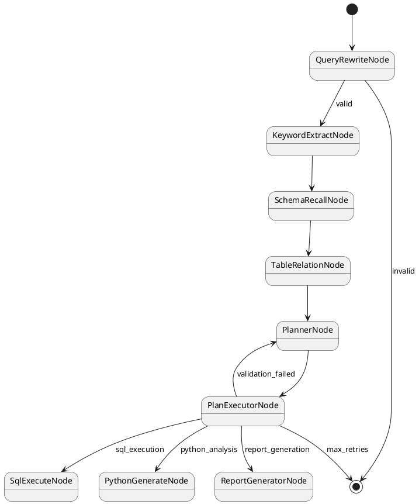

# Nl2sqlConfiguration.nl2sqlGraph() 核心方法详解

## 🎯 方法概述

`nl2sqlGraph()` 方法是Spring AI Alibaba NL2SQL项目的核心配置方法，负责构建整个Graph工作流的结构和执行逻辑。

```java
@Bean
public StateGraph nl2sqlGraph(ChatClient.Builder chatClientBuilder) throws GraphStateException
```

**方法作用**:
- 创建并配置NL2SQL的StateGraph工作流
- 定义13个核心节点和它们之间的连接关系
- 设置状态管理策略和路由规则
- 生成工作流的可视化表示

## 🔧 第一部分：KeyStrategyFactory (L164-L217)

### 代码分析

```java
KeyStrategyFactory keyStrategyFactory = () -> {
    HashMap<String, KeyStrategy> keyStrategyHashMap = new HashMap<>();
    // 用户输入
    keyStrategyHashMap.put(INPUT_KEY, new ReplaceStrategy());
    // 数据集ID
    keyStrategyHashMap.put(Constant.AGENT_ID, new ReplaceStrategy());
    // 智能体ID
    keyStrategyHashMap.put(AGENT_ID, new ReplaceStrategy());
    // 业务知识
    keyStrategyHashMap.put(BUSINESS_KNOWLEDGE, new ReplaceStrategy());
    // 语义模型
    keyStrategyHashMap.put(SEMANTIC_MODEL, new ReplaceStrategy());
    // queryWrite节点输出
    keyStrategyHashMap.put(QUERY_REWRITE_NODE_OUTPUT, new ReplaceStrategy());
    // ... 更多状态键配置
    return keyStrategyHashMap;
};
```

### 设计原理

#### 1. KeyStrategyFactory的作用

**KeyStrategyFactory** 是一个工厂接口，用于定义Graph工作流中状态数据的管理策略。

```java
public interface KeyStrategyFactory {
    Map<String, KeyStrategy> getKeyStrategies();
}
```

#### 2. KeyStrategy状态管理策略

**KeyStrategy** 定义了当状态数据更新时如何处理新旧值的合并：

```java
public interface KeyStrategy {
    Object merge(Object existing, Object update);
}
```

#### 3. ReplaceStrategy替换策略

**ReplaceStrategy** 是最简单的状态管理策略：

```java
public class ReplaceStrategy implements KeyStrategy {
    @Override
    public Object merge(Object existing, Object update) {
        return update;  // 新值直接替换旧值
    }
}
```

#### 4. 状态键分类

根据代码中的配置，状态键可以分为以下几类：

##### 输入参数类
- `INPUT_KEY`: 用户原始输入
- `AGENT_ID`: 智能体标识符
- `Constant.AGENT_ID`: 数据集ID（兼容性）

##### 业务知识类
- `BUSINESS_KNOWLEDGE`: 业务领域知识
- `SEMANTIC_MODEL`: 语义模型信息

##### 节点输出类
- `QUERY_REWRITE_NODE_OUTPUT`: 问题重写结果
- `KEYWORD_EXTRACT_NODE_OUTPUT`: 关键词提取结果
- `SQL_GENERATE_OUTPUT`: SQL生成结果
- `SQL_EXECUTE_NODE_OUTPUT`: SQL执行结果
- `PYTHON_EXECUTE_NODE_OUTPUT`: Python执行结果

##### 控制流程类
- `PLAN_CURRENT_STEP`: 当前执行步骤
- `PLAN_NEXT_NODE`: 下一个目标节点
- `PLAN_VALIDATION_STATUS`: 计划验证状态
- `SQL_GENERATE_COUNT`: SQL生成重试次数
- `PYTHON_TRIES_COUNT`: Python执行重试次数

### 设计意义

1. **状态隔离**: 每个状态键都有独立的管理策略
2. **数据一致性**: 确保状态更新的原子性
3. **扩展性**: 可以为不同类型的数据定义不同的合并策略
4. **调试友好**: 清晰的状态键命名便于调试和监控

## 🏗️ 第二部分：节点注册 (L219-L235)

### 代码分析

```java
StateGraph stateGraph = new StateGraph(NL2SQL_GRAPH_NAME, keyStrategyFactory)
    .addNode(QUERY_REWRITE_NODE, node_async(new QueryRewriteNode(nl2SqlService)))
    .addNode(KEYWORD_EXTRACT_NODE, node_async(new KeywordExtractNode(nl2SqlService)))
    .addNode(SCHEMA_RECALL_NODE, node_async(new SchemaRecallNode(schemaService)))
    .addNode(TABLE_RELATION_NODE,
            node_async(new TableRelationNode(schemaService, nl2SqlService, businessKnowledgeRecallService,
                    semanticModelRecallService)))
    .addNode(SQL_GENERATE_NODE, node_async(new SqlGenerateNode(chatClientBuilder, nl2SqlService)))
    .addNode(PLANNER_NODE, node_async(new PlannerNode(chatClientBuilder)))
    .addNode(PLAN_EXECUTOR_NODE, node_async(new PlanExecutorNode()))
    .addNode(SQL_EXECUTE_NODE, node_async(new SqlExecuteNode(dbAccessor, datasourceService)))
    .addNode(PYTHON_GENERATE_NODE,
            node_async(new PythonGenerateNode(codeExecutorProperties, chatClientBuilder)))
    .addNode(PYTHON_EXECUTE_NODE, node_async(new PythonExecuteNode(codePoolExecutor)))
    .addNode(PYTHON_ANALYZE_NODE, node_async(new PythonAnalyzeNode(chatClientBuilder)))
    .addNode(REPORT_GENERATOR_NODE, node_async(new ReportGeneratorNode(chatClientBuilder, promptConfigService)))
    .addNode(SEMANTIC_CONSISTENCY_NODE, node_async(new SemanticConsistencyNode(nl2SqlService)));
```

### 设计原理

#### 1. StateGraph构造

```java
new StateGraph(NL2SQL_GRAPH_NAME, keyStrategyFactory)
```

- `NL2SQL_GRAPH_NAME`: Graph的唯一标识符
- `keyStrategyFactory`: 状态管理策略工厂

#### 2. node_async异步包装

**node_async** 是一个静态方法，将同步节点包装为异步执行：

```java
public static AsyncNodeAction node_async(NodeAction nodeAction) {
    return new AsyncNodeAction() {
        @Override
        public CompletableFuture<Map<String, Object>> execute(
                OverAllState state, RunnableConfig config) {
            return CompletableFuture.supplyAsync(() -> {
                return nodeAction.execute(state, config);
            });
        }
    };
}
```

**异步包装的优势**:
- **非阻塞执行**: 不阻塞主线程
- **并发处理**: 支持多个节点并行执行
- **流式输出**: 支持实时数据流传输
- **资源优化**: 更好的线程池利用

#### 3. 13个核心节点分析

##### 自然语言理解阶段
1. **QueryRewriteNode**: 问题重写和标准化
2. **KeywordExtractNode**: 关键词和实体提取

##### Schema检索阶段
3. **SchemaRecallNode**: 数据库Schema召回
4. **TableRelationNode**: 表关系构建和业务知识融合

##### 智能规划阶段
5. **PlannerNode**: 执行计划制定
6. **PlanExecutorNode**: 计划验证和执行控制

##### SQL处理阶段
7. **SqlGenerateNode**: SQL语句生成
8. **SqlExecuteNode**: SQL执行
9. **SemanticConsistencyNode**: 语义一致性检查

##### Python分析阶段
10. **PythonGenerateNode**: Python代码生成
11. **PythonExecuteNode**: Python代码执行
12. **PythonAnalyzeNode**: Python结果分析

##### 报告生成阶段
13. **ReportGeneratorNode**: 综合报告生成

#### 4. 依赖注入设计

每个节点都通过构造函数注入所需的服务：

```java
// 示例：TableRelationNode的依赖
new TableRelationNode(
    schemaService,                    // Schema服务
    nl2SqlService,                   // NL2SQL核心服务
    businessKnowledgeRecallService,  // 业务知识召回服务
    semanticModelRecallService       // 语义模型召回服务
)
```

这种设计实现了：
- **松耦合**: 节点与具体实现解耦
- **可测试性**: 便于单元测试和Mock
- **可扩展性**: 易于替换和扩展服务实现

## 🔗 第三部分：边连接定义 (L237-L267)

### 代码分析

```java
stateGraph.addEdge(START, QUERY_REWRITE_NODE)
    .addConditionalEdges(QUERY_REWRITE_NODE, edge_async(new QueryRewriteDispatcher()),
            Map.of(KEYWORD_EXTRACT_NODE, KEYWORD_EXTRACT_NODE, END, END))
    .addEdge(KEYWORD_EXTRACT_NODE, SCHEMA_RECALL_NODE)
    .addEdge(SCHEMA_RECALL_NODE, TABLE_RELATION_NODE)
    .addEdge(TABLE_RELATION_NODE, PLANNER_NODE)
    .addEdge(PLANNER_NODE, PLAN_EXECUTOR_NODE)
    // ... 更多边的定义
```

### 设计原理

#### 1. 边的类型

##### 简单边 (addEdge)
```java
.addEdge(START, QUERY_REWRITE_NODE)  // 固定路径
.addEdge(KEYWORD_EXTRACT_NODE, SCHEMA_RECALL_NODE)  // 顺序执行
```

**特点**:
- 无条件执行
- 固定的下一个节点
- 适用于线性流程

##### 条件边 (addConditionalEdges)
```java
.addConditionalEdges(QUERY_REWRITE_NODE, edge_async(new QueryRewriteDispatcher()),
        Map.of(KEYWORD_EXTRACT_NODE, KEYWORD_EXTRACT_NODE, END, END))
```

**特点**:
- 基于状态数据的动态路由
- 支持多个可能的下一个节点
- 通过Dispatcher实现决策逻辑

#### 2. edge_async异步包装

```java
public static AsyncEdgeAction edge_async(EdgeAction edgeAction) {
    return new AsyncEdgeAction() {
        @Override
        public CompletableFuture<String> execute(
                OverAllState state, RunnableConfig config) {
            return CompletableFuture.supplyAsync(() -> {
                return edgeAction.execute(state, config);
            });
        }
    };
}
```

#### 3. 路由映射表

条件边使用Map定义路由规则：

```java
Map.of(
    KEYWORD_EXTRACT_NODE, KEYWORD_EXTRACT_NODE,  // 条件1 -> 目标节点1
    END, END                                      // 条件2 -> 目标节点2
)
```

#### 4. 复杂路由示例

```java
.addConditionalEdges(PLAN_EXECUTOR_NODE, edge_async(new PlanExecutorDispatcher()), Map.of(
        // If validation fails, go back to PlannerNode to repair
        PLANNER_NODE, PLANNER_NODE,
        // If validation passes, proceed to the correct execution node
        SQL_EXECUTE_NODE, SQL_EXECUTE_NODE, 
        PYTHON_GENERATE_NODE, PYTHON_GENERATE_NODE,
        REPORT_GENERATOR_NODE, REPORT_GENERATOR_NODE,
        // If max repair attempts are reached, end the process
        END, END))
```

这个路由表定义了PlanExecutorNode的5种可能路径：
1. 验证失败 → 返回PLANNER_NODE重新规划
2. SQL执行 → 进入SQL_EXECUTE_NODE
3. Python分析 → 进入PYTHON_GENERATE_NODE
4. 报告生成 → 进入REPORT_GENERATOR_NODE
5. 超过重试次数 → 结束流程(END)

#### 5. 工作流拓扑结构

基于边的定义，整个工作流形成了一个有向图：

```
START → QueryRewriteNode → [Dispatcher] → KeywordExtractNode
                                      ↘
                                        END

KeywordExtractNode → SchemaRecallNode → TableRelationNode → PlannerNode
                                                                ↓
ReportGeneratorNode ← PlanExecutorNode ← [Dispatcher] ← PlanExecutorNode
        ↓                    ↓
       END              SqlExecuteNode → [Dispatcher] → SemanticConsistencyNode
                             ↓                              ↓
                        SqlGenerateNode ← [Dispatcher] ← [Dispatcher]
                             ↓
                        [Dispatcher]
                        ↓         ↓
              KeywordExtractNode  END
```

### 设计优势

1. **灵活路由**: 支持复杂的条件分支逻辑
2. **错误恢复**: 失败时可以回到之前的节点重试
3. **多模态处理**: 同一个流程可以处理SQL查询、Python分析、报告生成
4. **循环控制**: 通过重试计数避免无限循环

## 📊 第四部分：图表示生成 (L268-L270)

### 代码分析

```java
GraphRepresentation graphRepresentation = stateGraph.getGraph(GraphRepresentation.Type.PLANTUML,
        "workflow graph");

logger.info("\n\n");
logger.info(graphRepresentation.content());
logger.info("\n\n");
```

### 设计原理

#### 1. GraphRepresentation接口

**GraphRepresentation** 是图表示的抽象接口：

```java
public interface GraphRepresentation {
    enum Type {
        PLANTUML,    // PlantUML格式
        MERMAID,     // Mermaid格式
        DOT,         // Graphviz DOT格式
        JSON         // JSON格式
    }
    
    String content();     // 获取图的文本表示
    Type getType();       // 获取图的类型
}
```

#### 2. PlantUML格式

**PlantUML** 是一种用文本描述UML图的工具，生成的内容类似：



#### 3. 可视化的价值

##### 开发阶段
- **架构理解**: 直观展示工作流结构
- **调试辅助**: 快速定位问题节点
- **文档生成**: 自动生成技术文档

##### 运维阶段
- **监控展示**: 实时显示执行路径
- **性能分析**: 识别瓶颈节点
- **故障排查**: 追踪异常路径

##### 业务阶段
- **流程说明**: 向业务人员解释处理逻辑
- **需求分析**: 验证业务流程的完整性
- **优化建议**: 识别可优化的环节

#### 4. 日志输出设计

```java
logger.info("\n\n");
logger.info(graphRepresentation.content());
logger.info("\n\n");
```

**设计考虑**:
- **可读性**: 前后空行增强可读性
- **调试友好**: 启动时输出完整图结构
- **运维支持**: 便于运维人员理解系统架构

## 🎯 整体设计模式分析

### 1. 建造者模式 (Builder Pattern)

```java
StateGraph stateGraph = new StateGraph(NL2SQL_GRAPH_NAME, keyStrategyFactory)
    .addNode(QUERY_REWRITE_NODE, node_async(new QueryRewriteNode(nl2SqlService)))
    .addNode(KEYWORD_EXTRACT_NODE, node_async(new KeywordExtractNode(nl2SqlService)))
    .addEdge(START, QUERY_REWRITE_NODE)
    .addConditionalEdges(QUERY_REWRITE_NODE, edge_async(new QueryRewriteDispatcher()), ...)
```

**优势**:
- **链式调用**: 代码简洁易读
- **逐步构建**: 分步骤构建复杂对象
- **不可变性**: 构建完成后对象不可修改

### 2. 策略模式 (Strategy Pattern)

```java
// 不同的状态管理策略
keyStrategyHashMap.put(INPUT_KEY, new ReplaceStrategy());
keyStrategyHashMap.put(EVIDENCES, new AppendStrategy());  // 假设的追加策略
keyStrategyHashMap.put(METADATA, new MergeStrategy());     // 假设的合并策略
```

**优势**:
- **策略可替换**: 运行时可以切换不同策略
- **扩展性**: 易于添加新的状态管理策略
- **单一职责**: 每个策略专注于特定的合并逻辑

### 3. 工厂模式 (Factory Pattern)

```java
KeyStrategyFactory keyStrategyFactory = () -> {
    // 工厂方法创建策略映射
    return keyStrategyHashMap;
};
```

**优势**:
- **创建封装**: 隐藏对象创建的复杂性
- **配置集中**: 所有策略配置在一处管理
- **依赖解耦**: 客户端不依赖具体策略类

### 4. 装饰器模式 (Decorator Pattern)

```java
// 异步装饰器
.addNode(QUERY_REWRITE_NODE, node_async(new QueryRewriteNode(nl2SqlService)))
.addConditionalEdges(QUERY_REWRITE_NODE, edge_async(new QueryRewriteDispatcher()), ...)
```

**优势**:
- **功能增强**: 为同步节点添加异步能力
- **透明性**: 不改变原有接口
- **组合灵活**: 可以叠加多个装饰器

## 🚀 性能和扩展性考虑

### 1. 异步执行优化

- **非阻塞**: 所有节点都是异步执行
- **并发控制**: 通过线程池管理并发度
- **资源利用**: 更好的CPU和I/O利用率

### 2. 状态管理优化

- **内存效率**: ReplaceStrategy避免不必要的对象累积
- **GC友好**: 及时释放不再需要的状态数据
- **线程安全**: 状态更新的原子性保证

### 3. 扩展性设计

- **节点可插拔**: 易于添加新的处理节点
- **路由可配置**: 调度器逻辑可以独立修改
- **策略可扩展**: 支持新的状态管理策略

### 4. 监控和调试

- **图可视化**: 便于理解和调试
- **状态追踪**: 完整的状态变化历史
- **性能监控**: 节点执行时间和资源消耗

## 📝 总结

`nl2sqlGraph()` 方法是一个精心设计的工作流配置方法，它体现了现代软件架构的多个最佳实践：

1. **声明式编程**: 通过配置而非编程定义复杂流程
2. **异步优先**: 全链路异步执行提升性能
3. **状态驱动**: 基于状态数据的智能路由
4. **模块化设计**: 节点和调度器的清晰分离
5. **可视化支持**: 自动生成流程图便于理解

这种设计使得NL2SQL系统具备了高性能、高可靠性和高可扩展性，为复杂的AI应用提供了强大的工作流编排能力。